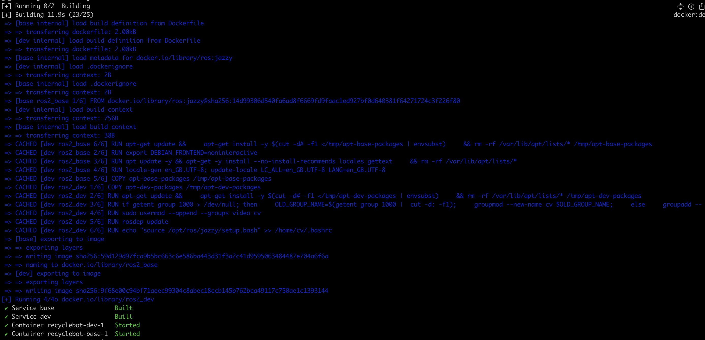
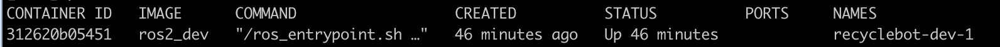
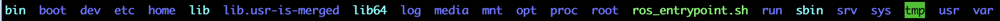

# recycleBot
CV based Pick-and-place system for trash sorting using ROS2 Jazzy inside a container environment. 

---

## 📘 Overview
**recycleBot** provides a portable ROS2 workspace configured for simulation, vision, and hardware control (designed with UR robots, a realsense camera, and a gripper which interfaces through a serial BUS).  

All development happens inside Docker, ensuring version-stable builds and easy deployment across machines.

---
## Devenv

For recyclebot, the  devenv workflow  uses Docker for ROS. This ensures that code runs in an isolated environment on the computer at hand, ensuring portability and version consistency between devices.

- [recycleBot](#recyclebot)
  - [Setting up the recyclebot environment](#setting-up-the-recyclebot-environment)
    - [1. **Prepare a Docker Image**](#1-prepare-a-docker-image)
    - [Prerequisites](#prerequisites)
    - [Run basic devcontainer setup with docker compose](#run-basic-devcontainer-setup-with-docker-compose)
    - [**Common issues**](#common-issues)
  - [Design of Container Structure](#design-of-container-structure)
    - [**Deployment vs. Development Containers**](#deployment-vs-development-containers)

<small><i><a href='http://ecotrust-canada.github.io/markdown-toc/'>Table of contents generated with markdown-toc</a></i></small>

_______

### Setting up the recyclebot environment

#### 1. **Prepare a Docker Image**

- We create an image in two steps:
  - **base** - **ROS & basic packages are installed** (ROS2 jazzy - supported until 2029).
  - **dev - packages used by recyclebot for vision, sim, and control **

You will find different kinds of files in this repository.  

- **`Dockerfile`**: instructions to build container, with any necessary tools and dependencies
- `docker-compose*.yml`  configuration to build, run and combine the images built using `Dockerfile`.
- `devcontainer.json`
  - builds services and provides the configuration vscode eventually uses (using the `*.yml files*`).
  - Mounts local source code  to the container's ROS workspace directory.
- `apt-**-packages` - contains list of packages installed in each phase of the docker image build

#### Prerequisites

*  Ubuntu linux (preferably 24.04.1 LTS) - use `hostnamectl` cmd to check the current version

  * ```bash
    # if not current version, upgrade with:
    sudo apt full-upgrade
    sudo apt install update-manager-core
    sudo do-release-upgrade
    
    # finalize by rebooting:
    sudo reboot
    ```

*  Install the real time kernel on your Ubuntu (needed for UR control)
  * ```bash
    # attach account to canonical to enable pro ubuntu mode
    sudo pro attach
    # update your dependencies
    sudo apt update && sudo apt install ubuntu-advantage-tools
    # enable real time kernel mode 
    sudo pro enable realtime-kernel

    # reboot the system
    reboot
    ``` 


* Docker -  install using the updated [docker installation page](https://docs.docker.com/engine/install/ubuntu/#prerequisites) WoW

  * ensure docker is given access priviledges:

    - add the `docker` group (if it doesn't already exist):
    
      ```
       sudo groupadd docker
      ```
    
    - add the connected user "$USER" to the `docker` group. (change username  if you do not want to use your current user):
    
      ```
       sudo gpasswd -a $USER docker
      ```
    
    - run  `newgrp docker` or log out/in to activate the changes to groups.
    
    - use the following to check if you can run Docker without `sudo`.
    
      ```
       docker run hello-world
      ```
    
    - run this in your host system terminal to allow Docker to Use Wayland in your host system (in case your ubuntu uses wayland instead of X11 for GUI forwarding to container)
      ```
        xhost +si:localuser:$USER
      ```

#### Run basic devcontainer setup with docker compose

1. clone the repository into your computer home: 

   ```bash
   cd ~
   git clone https://github.com/TU-robolab/recyclebot.git
   ```

2. download the large files/models with git-lfs  in your repository 

   ```bash
   cd recyclebot
   git-lfs pull
   ```
3. configure your local environment variables using the export_env script

   ```bash
   ./export_env.sh
   ```

4. build your container
   ```bash
   docker compose --env-file .env -f docker-compose.base.yml -f docker-compose.dev.yml build 
   # if needed you can add --no-cache in case you had older versions there
   docker compose -f docker-compose.base.yml -f docker-compose.dev.yml up -d
   ```

   * you should see something like: 

     

4. run `docker ps` to see final container:

   

5. connect to container once built:

   ```bash
   docker exec -it recyclebot-dev-1 /bin/bash
   ```

   * you should be able to ls/ run basic ROS commands:

     

     


------

#### **Common issues**

**Resetting the Build Cache due to build issues**:

- for build problems in the container, resets the container to a clean state by deleting the `build_cache` volume:

  ```bash
  docker volume rm build_cache
  ```


**permission denied while trying to connect to the Docker daemon socket**

* ensure docker daemon is running:

  ```bash
  sudo systemctl status docker
  sudo systemctl start docker # if not started , if so , do sudo systemctl restart docker
  sudo systemctl enable docker # ensure it starts in system init
  ```

* Verify docker is installed correctly:

  ```bash
  docker --version
  docker run hello-world
  ```

* check docker daemon socket:

  ```bash
  ls -l /var/run/docker.sock
  
  # output should be
  $ srw-rw---- 1 root docker ...
  
  ```


____

### Design of Container Structure

* there are two main types of containers: **development containers** and **deployment containers**:

#### **Deployment vs. Development Containers**

- **Deployment (prod) Containers** :
  - Everything (ROS, your configurations, workspace, etc.) is set up in the `Dockerfile`.
  - No bind mounts or local directories are used; the container runs in isolation.
- **Development (dev) Containers**:
  - Used for active prototyping
  - prioritizes  flexibility to edit files, build, and experiment without frequent image rebuilds via:
    - **build-cache** to the `.bashrc` or build artifacts in the container are stored in the **build_cache** volume, so you don’t lose progress when the container shuts down.
    - **git based development** - syncing code to container is simple by updating git repositories and using the bind mount, and can happen in your local computers/setup
      - if you want to **debug locally in container**, you can use the **VScode dev containers plugin directly**
        - this allows you to run/develop projects inside the container environment directly in VS Code

------

#vnc setup cv@cv-NUC8i3BEH:~/recyclebot$ x0vncserver -localhost no -passwordfile ~/.vnc/passwd -display $DISPLAY


___ 
for pose euler to quaternion conversions
https://www.andre-gaschler.com/rotationconverter/


# ROS 2 Gripper Control Stack

This package contains a modular ROS 2 stack for controlling a gripper over a serial interface.

---

## Package Overview

The project consists of **three main components**:

---

### 1. `grip_interface`

A simple and clean ROS 2 service definition for triggering gripper actions.

#### Service Definition

```
string action
---
bool success
string message
```

- `action`: Command string to be interpreted by the gripper (e.g. "grip", "release").
- `success`: Indicates whether the command was executed successfully.
- `message`: Human-readable status or error description.

---

### 2. `grip_command_package`

This package is the core control logic for operating the gripper via a serial interface. It includes both a ROS 2 node and a launch file, integrating the hardware interface (remote_serial) and the UR robot driver for full system startup.

#### Key Components
A fully featured node that:

Implements the grip_interface service under `/gripper_action`
Publishes serial commands via `/serial/com1/inject/output`
Subscribes to `/serial/com1/inspect/input` to receive inspection data
Publishes object detection results on `/object_detection/status`
Periodically sends sensor queries using a timer
Has a debug parameter (set via launch file) to control verbose logging
Initializes the gripper on startup via a custom serial command
Launch File: `master_launch.py`


#### This launch file brings up the full system, including:

- UR Robot Driver
Launches ur_robot_driver with tool communication enabled, using `/tmp/ttyUR` as the tool port.

- Serial Interface (remote_serial)
Starts the `remote_serial_standalone` node with full configuration for baud rate, data bits, stop bits, flow control, etc.

- Gripper Node
Launches `gripper_node` from `grip_command_package`.

This launch setup ensures the entire pipeline — robot arm, serial access, and gripper control — comes online seamlessly.

### 3. `serial`

This package integrates the powerful and flexible [`remote_serial`](https://github.com/openvmp/serial) implementation.

### Highlights

- Full ROS 2 integration for serial I/O
- Handles serial line **saturation gracefully**
- Prevents data loss and blocking behavior
- Exposes serial ports as ROS 2 interfaces for introspection and debugging

This package ensures **stable and performant communication** even in high-throughput or error-prone serial environments.

---

## Getting Started

### Start the robot:

Start robot over teach pendant and initiialize it so its at least in robot idle mode


### Start the system:

```bash
ros2 launch grip_command_package master.launch.py
```

This will:
- Start the UR driver
- Connect to the gripper over serial
- Bring up the service interface
- Publishes the gripper status on `/object_detection/status`

### Send a Command

You can call the service like this:

```bash
ros2 service call /gripper_action grip_interface/srv/GripCommand "{action: 'grip'}"
```
or
```bash
ros2 service call /gripper_action grip_interface/srv/GripCommand "{action: 'release'}"
```

### Echo the gripper detection status:
```bash
ros2 topic echo /object_detection/status
```

---
