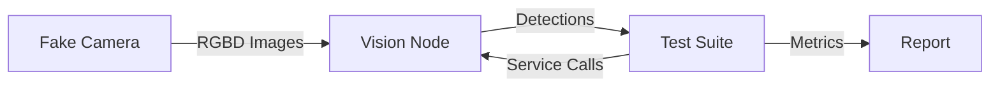

# RecycleBot Test Suite

Automated end-to-end integration tests for RecycleBot vision detection system without requiring hardware.

---

## Table of Contents

- [Quick Start](#quick-start)
- [Overview](#overview)
- [Test Architecture](#test-architecture)
- [Running Tests](#running-tests)
- [Test Reports](#test-reports)
- [Test Cases](#test-cases)
- [Performance Metrics](#performance-metrics)
- [Troubleshooting](#troubleshooting)
- [Package Structure](#package-structure)
- [Automation & CI/CD](#automation--cicd)

---

## Quick Start

### Run Tests (Automated)

```bash
# Inside Docker container
docker exec -it recyclebot-mac-1 /ros_entrypoint.sh bash
cd ~/ros2_ws/src/test_suite
bash scripts/run_vision_test.sh
```

### From Host Machine

```bash
docker exec recyclebot-mac-1 /ros_entrypoint.sh bash -c \
  "cd ~/ros2_ws/src/test_suite && bash scripts/run_vision_test.sh"
```

### View Report

```bash
# Inside container
cat /tmp/vision_workflow_test_report.txt

# From host
docker exec recyclebot-mac-1 cat /tmp/vision_workflow_test_report.txt

# Copy to host
docker cp recyclebot-mac-1:/tmp/vision_workflow_test_report.txt ./
```

---

## Overview

### What Gets Tested

The vision workflow tests validate the complete object detection pipeline:

```
Fake RGBD Camera → Vision Detector Node → Object Detections
     (simulator)        (YOLO model)         (ROS2 topics)
```

**Test Coverage:**
1. ✓ **Service Availability** - `/capture_detections` service is accessible
2. ✓ **Detection Triggering** - Service calls successfully trigger detections
3. ✓ **Topic Publishing** - Detections published to `/object_detections` topic
4. ✓ **Detection Format** - Output has valid structure, bounding boxes, and confidence scores
5. ✓ **RGBD Data Available** - RGBD frames publishing with correct resolution and encoding
6. ✓ **Depth Channel Validation** - Depth data matches D415 specs and quality standards

### Key Features

- **Automated execution** with startup, testing, and cleanup
- **Detailed reporting** with performance metrics and detection metadata
- **No hardware required** - uses fake RGBD publisher for testing
- **Multiple output formats** - console output and saved report file
- **Performance tracking** - Response times, latencies, and object counts
- **Frame visualization** - RGB, depth heatmap, and side-by-side comparison
- **Depth validation** - Statistics, range checks, and quality metrics
- **Visual feedback** - Depth colormap with legend (red=close, blue=far)

### Test Components

**Fake RGBD Publisher** (`scripts/fake_rgbd_publisher.py`)
- Simulates RealSense D415 camera output
- Publishes synthetic RGBD images at 30Hz (matching D415 specs)
- Topic: `/camera/camera/rgbd`
- RGB: 1280x720 @ bgr8 encoding
- Depth: 1280x720 @ 16UC1 encoding (Z16 format)
- Realistic depth values (300-3000mm range)
- Object-aligned depth for RGB shapes
- Sensor noise simulation (±2mm std dev)
- Invalid pixels (2%) for realistic sensor behavior
- Depth scale: 1.0 (values in millimeters)

**Vision Detector Node** (from `recycle_bot` package)
- YOLO-based object detection
- Processes RGBD images
- Publishes to `/object_detections`
- Service: `/capture_detections`

**Test Suite** (`test/test_vision_workflow.py`)
- pytest-based integration tests
- ROS2 node for subscribing and service calls
- Automated report generation with metrics
- Frame visualization with depth colormap and legend
- Depth channel validation and statistics
- Outputs saved to `test_output/` directory

---

## Test Architecture

### Test Flow

```
1. Clean up old visualization files
   ↓
2. Start fake RGBD publisher (background)
   ↓
3. Start vision detector node (background)
   ↓ (wait 10s for YOLO model to load)
4. Run pytest test suite (6 tests)
   ↓
5. Save frame visualizations (RGB, Depth, Combined)
   ↓
6. Generate detailed report
   ↓
7. Copy visualizations to test_output/
   ↓
8. Open combined visualization (if supported)
   ↓
9. Cleanup (terminate nodes)
```

### Pipeline Overview



---

## Running Tests

### Method 1: Automated Script (Recommended)

```bash
# Inside Docker container
cd ~/ros2_ws/src/test_suite
bash scripts/run_vision_test.sh
```

**What it does:**
- Starts fake RGBD publisher
- Starts vision detector node
- Waits for initialization (10 seconds)
- Runs pytest test suite
- Generates report
- Cleans up all processes
- Returns exit code 0 for success, 1 for failure

### Method 2: Direct pytest

For more control or debugging:

```bash
# With verbose output
python3 -m pytest test/test_vision_workflow.py -v

# With live console output (see test progress)
python3 -m pytest test/test_vision_workflow.py -v -s

# Run specific test
python3 -m pytest test/test_vision_workflow.py::TestVisionWorkflow::test_04_detection_format -v

# Stop on first failure
python3 -m pytest test/test_vision_workflow.py -v -x
```

**Note:** When running manually, you must start the fake publisher and vision node separately:

```bash
# Terminal 1
ros2 run test_suite fake_rgbd_publisher

# Terminal 2
ros2 run recycle_bot rec_bot_vision

# Terminal 3
python3 -m pytest test/test_vision_workflow.py -v -s
```

### Method 3: From Host Machine

```bash
# Run complete test
docker exec recyclebot-mac-1 /ros_entrypoint.sh bash -c \
  "cd ~/ros2_ws/src/test_suite && bash scripts/run_vision_test.sh"

# View report
docker exec recyclebot-mac-1 cat /tmp/vision_workflow_test_report.txt
```

### Prerequisites

- Docker container running (`recyclebot-mac-1`)
- ROS2 workspace built: `colcon build`
- Packages installed: `recycle_bot`, `test_suite`

---

## Test Reports

### Console Output Example

Tests provide real-time output during execution:

```
================================================================================
VISION WORKFLOW TEST REPORT
================================================================================
Test started at: 2026-01-09 17:48:01
================================================================================

[Test 1] Service available: True (took 0.00s)
[Test 2] Service response: True (2485.69ms)
         Message: Added 2 potential new detections
[Test 3] Detections published: 2 objects
         Latency: 1311.16ms
[Test 4] Detection format validated: 2 objects
         Object 1: flower_pot (93.06%)
           BBox: (575.0, 273.9) 155.0x254.0px
         Object 2: box_pp (62.55%)
           BBox: (400.8, 599.0) 118.0x118.0px
```

### Quick Summary

At the end of tests, a comprehensive summary is displayed:

```
================================================================================
VISION WORKFLOW TEST SUMMARY
================================================================================

────────────────────────────────────────────────────────────────────────────────
QUICK SUMMARY
────────────────────────────────────────────────────────────────────────────────
  - Duration: 15.28 seconds
  - Service Response: 2485.69ms average
  - Detection Latency: 1311.16ms average
  - Objects Detected: 2 objects
    - 1 box_pp (62.55%)
    - 1 flower_pot (93.06%)

Test completed at: 2026-01-09 17:48:16

Service Response Times:
  Average: 2485.69ms
  Min: 2485.69ms
  Max: 2485.69ms

Detection Latencies:
  Average: 1311.16ms
  Min: 1311.16ms
  Max: 1311.16ms
```

### Detailed Detection Results

```
────────────────────────────────────────────────────────────────────────────────
DETECTION RESULTS
────────────────────────────────────────────────────────────────────────────────

Total detections captured: 1

Detection Set #1:
  Timestamp: 2026-01-09 17:48:16.166
  Number of objects: 2

  Object 1:
    Class ID: flower_pot
    Confidence: 93.06%
    Bounding Box:
      Center: (575.0, 273.9)
      Size: 155.0 x 254.0 pixels
      Area: 39370.0 px²

  Object 2:
    Class ID: box_pp
    Confidence: 62.55%
    Bounding Box:
      Center: (400.8, 599.0)
      Size: 118.0 x 118.0 pixels
      Area: 13924.0 px²
```

### Test Results Summary

```
────────────────────────────────────────────────────────────────────────────────
TEST RESULTS
────────────────────────────────────────────────────────────────────────────────
✓ PASSED - Service Availability
  Service became available in 0.00s
✓ PASSED - Trigger Detection Service
  Response time: 2485.69ms, Message: Added 2 potential new detections
✓ PASSED - Detections Published
  Received 2 detections, latency: 1311.16ms
✓ PASSED - Detection Format & Details
  Validated 2 detections with proper format
```

### Saved Report File

A text report is automatically saved to `/tmp/vision_workflow_test_report.txt` inside the Docker container with the quick summary and detailed detection information.

---

## Test Cases

### Test 1: Service Availability

**Purpose:** Verify the `/capture_detections` service is running and accessible

**What it checks:**
- Service becomes available within 15 seconds
- ROS2 service discovery works correctly

**Measured metrics:**
- Time until service is available

**Success criteria:** Service is found within timeout period

---

### Test 2: Trigger Detection Service

**Purpose:** Verify service calls successfully trigger object detection

**What it checks:**
- Service accepts Trigger requests
- Vision node processes the request
- Response message indicates detection occurred
- Service response time is reasonable

**Measured metrics:**
- Service call response time (includes YOLO inference)

**Success criteria:**
- Service returns success=True
- Response message contains "detection"
- Response received within 30 seconds

---

### Test 3: Detections Published

**Purpose:** Verify detections are published to the `/object_detections` topic

**What it checks:**
- Detection messages arrive on topic
- Topic publishing happens after service call
- Detection array is not empty

**Measured metrics:**
- Detection latency (service call → topic message)
- Number of objects detected

**Success criteria:**
- At least one detection message received
- Message is valid Detection2DArray type
- Detection array contains objects

---

### Test 4: Detection Format & Details

**Purpose:** Validate detection message structure and capture detailed metadata

**What it checks:**
- Bounding boxes have valid dimensions
- Center coordinates exist
- Confidence scores are in valid range [0.0, 1.0]
- Class IDs are present
- All required fields are populated

**Measured metrics:**
- Per-object metadata:
  - Class ID (e.g., "flower_pot", "box_pp")
  - Confidence score (0-100%)
  - Bounding box center (x, y)
  - Bounding box size (width, height)
  - Bounding box area (pixels²)

**Success criteria:**
- All bounding boxes have positive dimensions
- All confidence scores are valid
- All required fields are non-null

---

### Test 5: RGBD Data Available

**Purpose:** Verify RGBD frames are being published from the fake camera

**What it checks:**
- RGBD messages arrive on `/camera/camera/rgbd` topic
- RGB and depth images are present and non-null
- Camera info messages are populated
- Image dimensions match expected resolution (1280x720)
- Encodings are correct (bgr8 for RGB, 16UC1 for depth)

**Measured metrics:**
- Number of frames received
- Image resolution
- Image encodings

**Success criteria:**
- At least one RGBD frame received within 5 seconds
- RGB width/height = 1280x720
- Depth width/height = 1280x720
- RGB encoding = "bgr8"
- Depth encoding = "16UC1"

---

### Test 6: Depth Channel Validation

**Purpose:** Validate depth channel has valid data matching D415 specifications

**What it checks:**
- Depth image format is 16-bit unsigned integer
- Depth image is single channel (grayscale)
- Depth values are within D415 working range (300-3000mm)
- Invalid pixels (0 values) are within reasonable threshold (<10%)
- Depth statistics are realistic

**Measured metrics:**
- Depth range (min/max in millimeters)
- Mean depth
- Standard deviation
- Valid pixel count and percentage
- Invalid pixel count and percentage

**Success criteria:**
- Depth dtype = uint16
- Depth shape = (720, 1280) - single channel
- Minimum depth >= 300mm
- Maximum depth <= 3000mm
- At least some valid depth pixels exist
- Invalid pixel percentage < 10%

**Frame Visualization:**
After tests complete, visualizations are automatically saved:
- `test_output/rgbd_rgb.png` - RGB image
- `test_output/rgbd_depth.png` - Depth heatmap with color scale legend
- `test_output/rgbd_combined.png` - Side-by-side RGB and depth

Depth colormap: Red/warm colors = closer objects, Blue/cool colors = farther objects

---

## Performance Metrics

### Service Response Time

**What it measures:** Time from service call to service response

**Includes:** YOLO inference time, image processing, ROS2 communication

**Typical values:**
- **CPU mode:** 2000-4000ms
- **GPU mode:** 200-500ms

**Factors affecting performance:**
- Hardware (CPU vs GPU)
- Model size (YOLOv8n vs YOLOv8m vs YOLOv8l)
- Image resolution
- Number of objects in scene

### Detection Latency

**What it measures:** Time from service call to detection message on topic

**Includes:** Service response time + topic publishing delay

**Typical values:** Service response + 100-500ms

**Note:** Should be close to service response time (within ~500ms)

### Confidence Scores

- **90-100%:** Very high confidence, object clearly identified
- **70-90%:** High confidence, reliable detection
- **50-70%:** Moderate confidence, may need verification
- **Below 50%:** Low confidence, may be false positive

### Object Classes

Common classes detected by the RecycleBot vision system:
- `flower_pot` - Plastic flower pots
- `box_pp` - Polypropylene boxes
- `food_jar_pet` - PET food jars
- `food_tetra` - Tetra pak containers
- `food_bottle_hdpe` - HDPE bottles
- And more (see YOLO model class list)

---

## Troubleshooting

### Quick Reference Table

| Issue | Quick Fix |
|-------|-----------|
| Tests not found | `colcon build --packages-select test_suite` |
| Service timeout | Check if vision node started: `ros2 node list` |
| No detections | Check fake publisher: `ros2 topic list` |
| Import errors | Source workspace: `source ~/ros2_ws/install/setup.bash` |
| Slow performance | Normal on CPU; use GPU for faster inference |

### Common Issues

#### 1. Service Not Available (Test 1 Fails)

**Symptoms:**
```
FAILED - Service /capture_detections not available after 15 seconds
```

**Possible causes:**
- Vision node didn't start
- ROS2 workspace not sourced
- Package not built

**Solutions:**
```bash
# Check if vision node is running
ros2 node list | grep vision

# Manually start vision node
ros2 run recycle_bot rec_bot_vision

# Rebuild workspace
cd ~/ros2_ws
colcon build --packages-select recycle_bot test_suite
source install/setup.bash
```

#### 2. Service Call Timeout (Test 2 Fails)

**Symptoms:**
```
FAILED - Service call timeout after 30 seconds
```

**Possible causes:**
- YOLO model failed to load
- Insufficient memory
- CUDA/GPU issues

**Solutions:**
```bash
# Check vision node logs
ros2 run recycle_bot rec_bot_vision

# Look for errors like:
# - "Failed to load YOLO model"
# - "Out of memory"
# - "CUDA error"

# Verify YOLO model file exists
ls ~/ros2_ws/src/packages/recycle_bot/models/
```

#### 3. No Detections Received (Test 3 Fails)

**Symptoms:**
```
FAILED - No detections received after 5 seconds
```

**Possible causes:**
- Fake RGBD publisher not running
- Topic name mismatch
- Vision node not subscribing to camera topic

**Solutions:**
```bash
# Check if fake publisher is running
ros2 node list | grep fake_rgbd

# Check topic connections
ros2 topic list
ros2 topic echo /camera/camera/rgbd --no-arr

# Verify detection topic
ros2 topic echo /object_detections
```

#### 4. Invalid Detection Format (Test 4 Fails)

**Symptoms:**
```
FAILED - Invalid bbox width / Invalid confidence score
```

**Possible causes:**
- YOLO model output corruption
- Message deserialization issue
- Vision node bug

**Solutions:**
```bash
# Check detection messages manually
ros2 topic echo /object_detections

# Verify fields:
# - bbox.size_x, bbox.size_y should be positive
# - hypothesis.score should be 0.0-1.0
# - hypothesis.class_id should be non-empty string
```

#### 5. Slow Performance

**Symptoms:**
- Tests pass but service response time > 5000ms
- Detection latency very high

**Possible causes:**
- Running on CPU instead of GPU
- Large YOLO model
- Resource contention

**Solutions:**
```bash
# Check if GPU is being used
# Look for "Using device: cuda" in vision node logs

# Monitor resource usage
docker stats recyclebot-mac-1

# Consider using smaller YOLO model
# Edit vision node to use yolov8n.pt instead of yolov8m.pt
```

### Getting More Information

#### Enable Debug Logging

Add `-s` flag to pytest to see all output:
```bash
python3 -m pytest test/test_vision_workflow.py -v -s
```

#### Check ROS2 Status

```bash
# List all nodes
ros2 node list

# Get info about vision node
ros2 node info /vision_detector

# Monitor topics in real-time
ros2 topic hz /object_detections
ros2 topic bw /camera/camera/rgbd
```

#### Manual Component Testing

Test components individually:

```bash
# Terminal 1: Start fake camera
ros2 run test_suite fake_rgbd_publisher

# Terminal 2: Start vision node
ros2 run recycle_bot rec_bot_vision

# Terminal 3: Trigger detection
ros2 service call /capture_detections std_srvs/srv/Trigger

# Terminal 4: Monitor detections
ros2 topic echo /object_detections
```

---

## Package Structure

```
test_suite/
├── README.md                        # This documentation
├── package.xml                      # ROS2 package definition
├── setup.py                         # Python package setup
├── scripts/
│   ├── run_vision_test.sh          # Automated test runner script
│   ├── fake_rgbd_publisher.py      # Fake camera simulator
│   └── fake_joint_state_publisher.py # Fake joint state publisher
├── test/
│   └── test_vision_workflow.py     # Main test suite
├── test_suite/                      # Python package
│   ├── __init__.py
│   ├── fake_rgbd_publisher.py
│   └── fake_joint_state_publisher.py
└── launch/
    └── test_vision_workflow.launch.py # ROS2 launch file (alternative)
```

### Building the Package

```bash
cd ~/ros2_ws
colcon build --packages-select test_suite
source install/setup.bash
```

---

## Automation & CI/CD

### GitHub Actions (Automatic)

Tests automatically run on GitHub when:

**Triggers:**
- Push to `main` or `dev/**` branches
- Pull requests to `main` or `dev/**`
- Changes to vision-related files:
  - `packages/recycle_bot/recycle_bot/rec_bot_vision.py`
  - `packages/recycle_bot/**/*.py`
  - `test_suite/` files
  - Docker configs

**Workflow:** `.github/workflows/vision-tests.yml`

**Steps:**
1. Checkout code → Build Docker → Start container
2. Build ROS2 workspace
3. Run vision tests
4. Upload test report artifact
5. Display results in PR summary

**View Results:**
- Check "Actions" tab in GitHub
- View summary in PR checks
- Download test report artifact

**Manual Trigger:**
- Actions → Vision Tests → Run workflow

### Pre-commit Hooks (Local)

Run tests automatically before pushing changes.

**Setup:**
```bash
# Install pre-commit
pip install pre-commit

# Install hooks
cd /path/to/recyclebot
pre-commit install --hook-type pre-commit --hook-type pre-push
```

**What Runs:**

*On Commit:*
- Docker Compose validation (when modifying docker-compose*.yml or export_env.sh)
- Trailing whitespace removal
- YAML syntax validation
- Python syntax check (AST)
- Large file detection (>100MB)
- Merge conflict detection

*On Push (vision files):*
- Vision workflow tests (when modifying vision node or tests)

**Manual Run:**
```bash
# All hooks
pre-commit run --all-files

# Vision tests only
pre-commit run vision-tests --all-files

# Skip hooks (not recommended)
git push --no-verify
```

**Update Hooks:**
```bash
pre-commit autoupdate
```

### Testing Stages Summary

| Stage | When | What Runs | Time | Can Skip |
|-------|------|-----------|------|----------|
| **On Commit** | `git commit` | Docker config validation, syntax checks | <1s | `--no-verify` |
| **On Push** | `git push` | Vision workflow tests (if vision files changed) | ~15s | `--no-verify` |
| **GitHub Actions** | Push/PR to GitHub | Complete CI pipeline with Docker build | ~15min | ❌ No |

### Complete Testing Flow

**1. On Commit (Local)**
```bash
git commit -m "fix: update docker config"

# Runs automatically:
✓ Docker Compose Validation (if docker-compose*.yml changed)
✓ Trailing whitespace removal
✓ YAML syntax validation
✓ Python syntax check
✓ Large file detection
✓ Merge conflict detection
```

**2. On Push (Local)**
```bash
git push origin feat/improve-detection

# Runs automatically if vision files changed:
✓ Vision Workflow Tests (~15s)
  - Service availability
  - Detection triggering
  - Topic publishing
  - Detection format validation
  → Quick summary with results
```

**3. On GitHub (Remote)**
```bash
# Triggers automatically on push/PR
✓ Checkout code
✓ Set up environment (export_env.sh)
✓ Build Docker container (~10 min)
✓ Build ROS2 workspace (~2 min)
✓ Run vision tests (~30 sec)
✓ Upload test report artifact
✓ Display results in PR summary
```

### Integration Example

Complete workflow for vision changes:

```bash
# 1. Make changes
vim packages/recycle_bot/recycle_bot/rec_bot_vision.py

# 2. Test locally (optional but recommended)
docker exec recyclebot-mac-1 /ros_entrypoint.sh bash -c \
  "cd ~/ros2_ws/src/test_suite && bash scripts/run_vision_test.sh"

# 3. Commit (syntax checks + docker validation run)
git add packages/recycle_bot/recycle_bot/rec_bot_vision.py
git commit -m "feat(vision): improve detection"
# ✓ All pre-commit checks passed

# 4. Push (vision tests run automatically)
git push origin feat/improve-detection
# ✓ Vision Workflow Tests.........Passed (15.28s)
#   - 2 objects detected

# 5. GitHub Actions run automatically
# → View results in PR checks
# → Download test report artifact
```

---

## Future Enhancements

Potential improvements to the test suite:

1. **Multiple test images** - Test with various object arrangements
2. **Performance benchmarks** - Compare against baseline metrics
3. **Regression testing** - Detect performance degradation
4. **GPU/CPU comparison** - Validate both execution modes
5. **Stress testing** - Rapid repeated detection calls
6. **Multi-object scenarios** - Test with many objects in frame
7. **Edge cases** - Empty frames, occlusions, lighting variations
8. **HTML reports** - Rich visual reports with graphs
9. **Detection accuracy metrics** - Compare against ground truth
10. **Video sequence testing** - Test temporal consistency

---

## Support

For issues or questions:

1. Check the [Troubleshooting](#troubleshooting) section above
2. Review ROS2 logs: `ros2 node list` and `ros2 topic list`
3. Check the main project README and Docker documentation
4. Verify all dependencies are installed and workspace is built
5. Review test output for specific error messages

---

## Version History

- **v1.0** (2026-01-09) - Initial comprehensive test suite
  - 4 core test cases covering complete vision workflow
  - Automated execution script with cleanup
  - Detailed console and file reporting with quick summary
  - Performance metrics collection (response times, latencies)
  - Detection metadata capture (bbox, confidence, class)
  - Complete documentation with troubleshooting guide

---

*Last updated: 2026-01-09*
